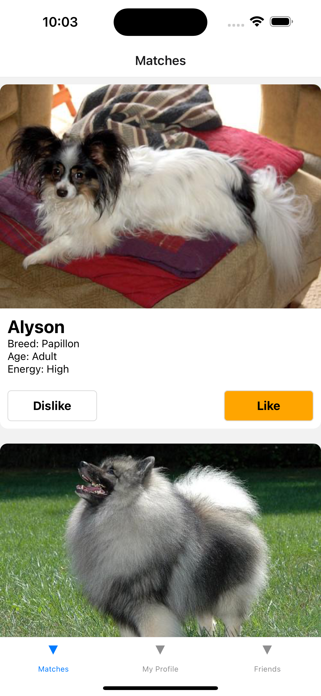
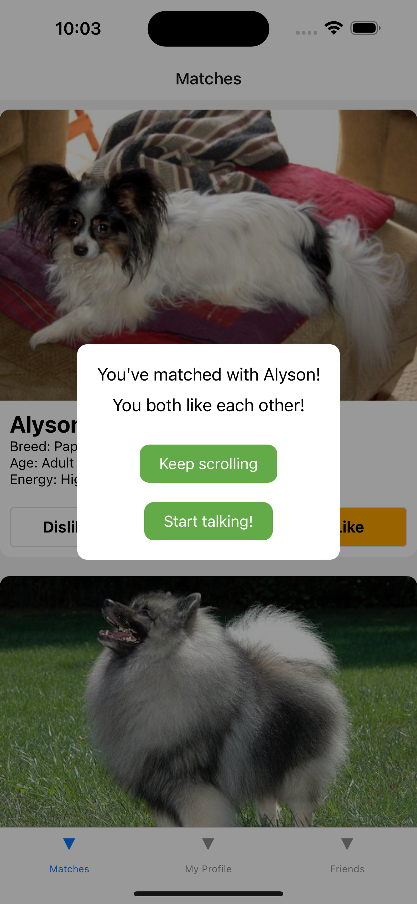
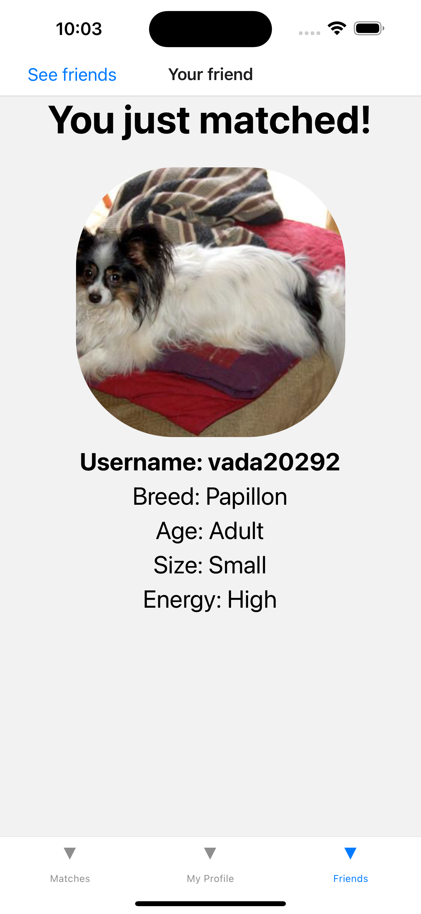
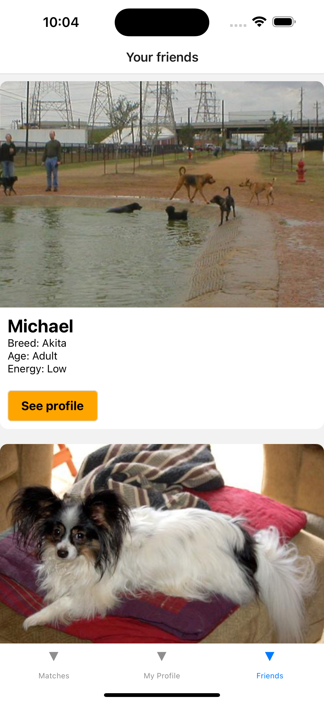
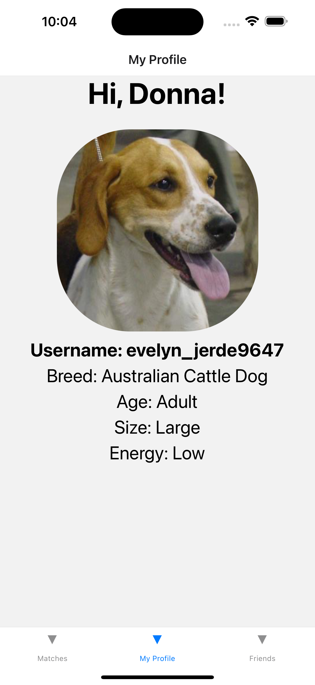

# Dig! - Dog Playdate Matching App

Dig! is a mobile app built to help dogs and their owners find compatible playmates. Utilizing Neo4j graph database technology, the app matches dogs based on their traits, past likes and dislikes, and friends. This project was developed as part of a four-day "stackathon" at Grace Hopper Bootcamp, where I was the sole developer.

---

## App Description

When users log in, they see a list of users that they can like and dislike, including a short description of each user. If both users match, they're added to each other's friends lists and can view each other's full profiles.

I used Neo4j to create the matching algorithm, combining collaborative filtering and the jaccard index to match dogs.

---

## Key Features

- Log in screen
- Infinite scroll screen with a constantly changing list of potential matches based on user's preferences, friends and traits
- Like and dislike options
- Instant match notification
- Ability to view friends' profiles
- Screen to see all friends
- Personal profile view

---

## Technologies Used

- React Native
- Node
- Express
- Javascript
- Node.js
- Neo4j

---

## Limitations

Dig! was created as a student project and is not currently deployed.

---

### Future Improvements

- Implement a chat system for matched dogs to communicate
- Refine and optimize the matching algorithm
- Allow users to upload their own dog profiles
- Implement location-based matching
- Implement push notifications for new matches
- Deploy the application

---

### The developer

Leah Treidler, [LinkedIn](https://www.linkedin.com/in/ltreidler/), [Portfolio](https://www.leahtreidler.com)
